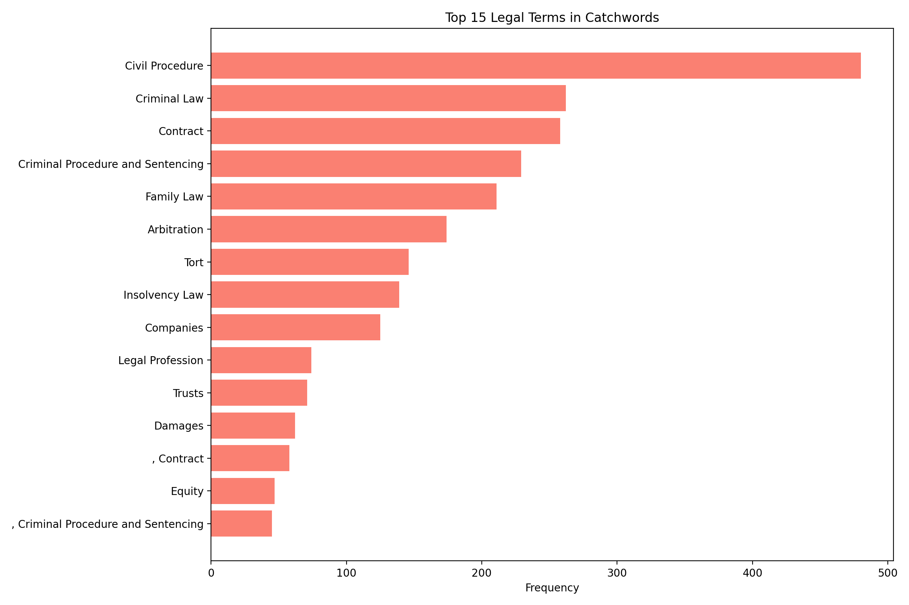
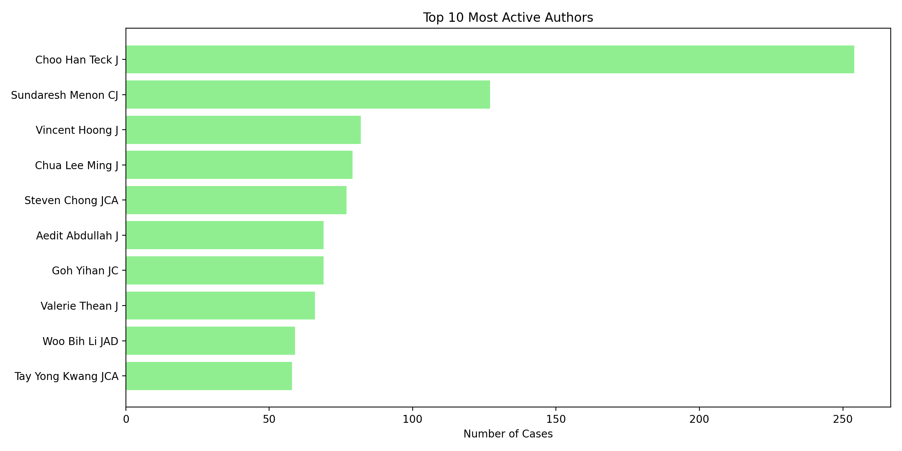
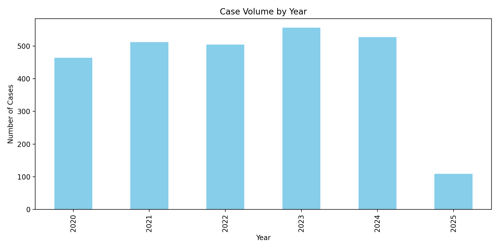

# Code of Law

Code of Law scrapes reported Singapore Supreme Court judgments from eLitigation and generates basic analytics/visualizations from the exported dataset.

## What this repository does
- Scrapes SG Supreme Court reported judgments by year (`elitiscrape.py`)
- Exports structured case data to CSV
- Runs analysis and chart generation (`analysis.py`)
- Saves charts to `tables/`

## Project structure
- `elitiscrape.py`: scraper CLI
- `analysis.py`: analysis + plot generation CLI
- `sample/elitigation_cases_2020_to_2025.csv`: sample dataset for local analysis
- `tables/`: generated chart outputs

## Requirements
- Python 3.10+
- Dependencies from `requirements.txt`

Install dependencies:

```sh
pip install -r requirements.txt
```

## Usage

### 1. Analyze existing sample data
This runs without scraping and regenerates charts in `tables/`.

```sh
python analysis.py --input sample/elitigation_cases_2020_to_2025.csv --output-dir tables
```

## Generated visuals

### Catchword Analysis


### Judge Count


### Yearly Breakdown


### 2. Scrape fresh data
Scrape a year range and write a CSV.

```sh
python elitiscrape.py --start-year 2020 --end-year 2025 --output sample/elitigation_cases_2020_to_2025.csv
```

Then analyze that CSV:

```sh
python analysis.py --input sample/elitigation_cases_2020_to_2025.csv --output-dir tables
```

## Command options

### Scraper (`elitiscrape.py`)
- `--start-year`: first year to scrape (default: `2020`)
- `--end-year`: last year to scrape (default: current year)
- `--output`: output CSV path (default: `sample/elitigation_cases_<start>_to_<end>.csv`)
- `--delay`: delay in seconds between list-page requests (default: `0.5`)
- `--timeout`: HTTP timeout in seconds (default: `20`)
- `--retries`: retries per request (default: `3`)
- `--max-pages`: optional page cap per year (for quick checks)
- `--max-cases`: optional total-case cap (for quick checks)

### Analysis (`analysis.py`)
- `--input`: input CSV path
- `--output-dir`: chart output directory (default: `tables`)
- `--top-authors`: top N authors in chart (default: `10`)
- `--top-terms`: top N catchword categories in chart (default: `15`)

## Output schema
The scraper outputs these CSV columns:
- `CaseIdentifier`
- `Catchwords`
- `Year`
- `URL`
- `WordCount`
- `ParagraphCount`
- `Author`
- `LegalParties`

## Validation
Quick validation run (small scrape + analysis):

```sh
python elitiscrape.py --start-year 2025 --end-year 2025 --max-pages 1 --max-cases 10 --output sample/validation_sample.csv
python analysis.py --input sample/validation_sample.csv --output-dir tables
```

## Notes
- Scraping depends on eLitigation page structure and availability.
- Some case fields may be missing if source pages omit them.
- Charts are generated with a non-interactive matplotlib backend so they work in terminal/headless environments.

## License
MIT License (see `LICENSE`).
