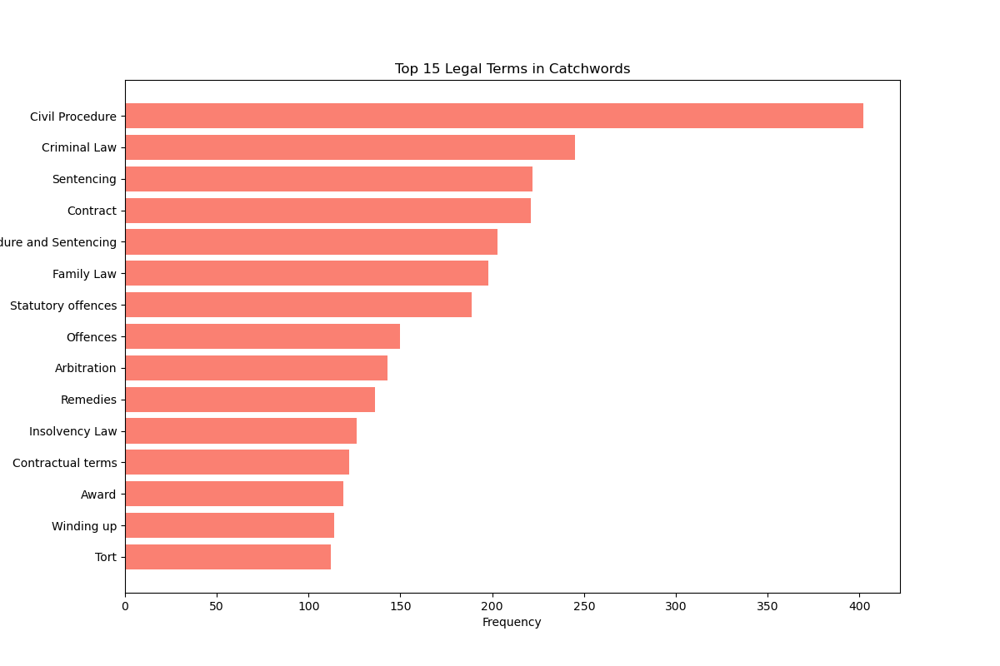
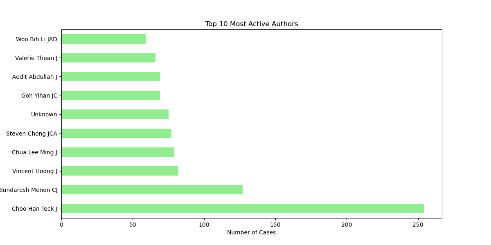
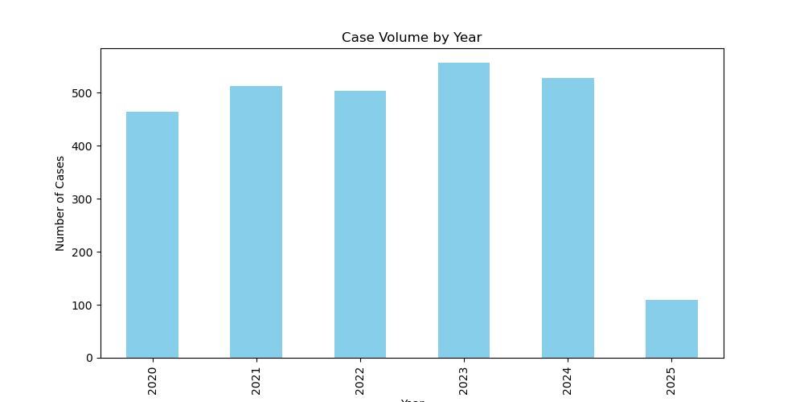

# Code of Law

## Overview
This repository is a **work in progress** statistical analysis of all reported Singapore High Court (SGHC) and Singapore Court of Appeal (SGCA) judgments.

## Data Visualisations
Below are some preliminary visualisations generated from the dataset using 2020 - 2025 cases (CAA 2 Apr 2025):
(In light of my upcoming finals for the semester this section will remain rather superficial for the time being)

### Catchword Analysis


### Judge Count


### Yearly Breakdown


## Methodology
This project utilizes a **web scraper** built with `BeautifulSoup` to extract all reported judgments from **eLitigation**. The scraped data is then processed and analyzed using statistical methods to identify trends, patterns, and other insights related to case law in Singapore. 

## Getting Started
### Prerequisites
To run the analysis, ensure you have the following installed:
- Python 3.x
- Required libraries (listed in `requirements.txt`)

### Installation
1. Clone this repository:
   ```sh
   git clone https://github.com/kevanwee/codeoflaw.git
   ```
2. Navigate to the project directory:
   ```sh
   cd codeoflaw
   ```
3. Install dependencies:
   ```sh
   pip install -r requirements.txt
   ```

## Usage
Run the main script to scrape data and generate statistical reports:
```sh
python analysis.py
```

## Contributing
Contributions are welcome! Feel free to fork the repo and submit a pull request.

## License
This project is licensed under the MIT License.

---
*Work in progress. More updates coming soon!*
